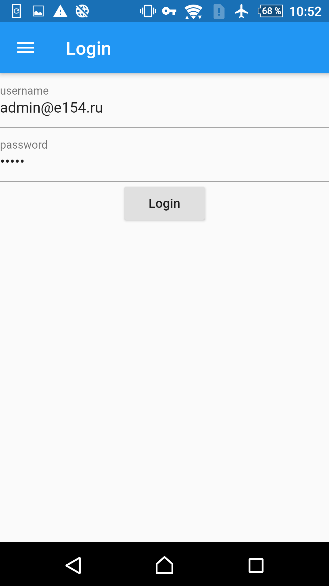
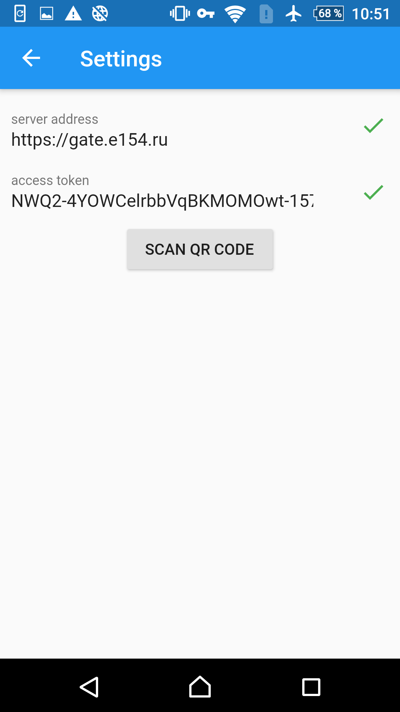
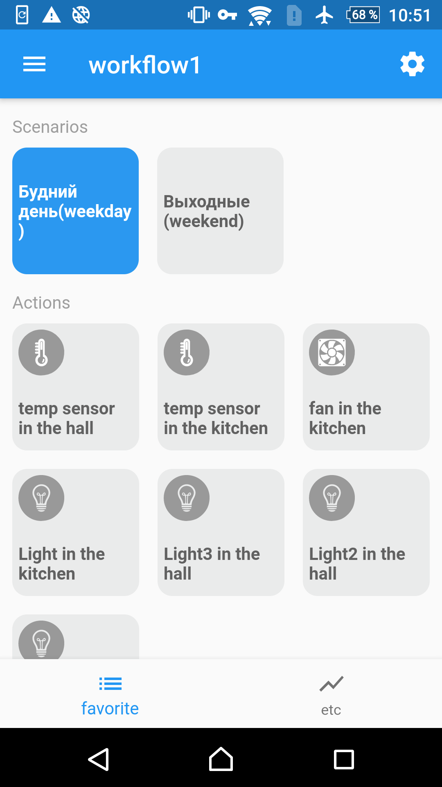

# The smart home mobile 

[Project site](https://e154.github.io/smart-home/) |
[Server](https://github.com/e154/smart-home/) |
[Configurator](https://github.com/e154/smart-home-configurator/) |
[Mobile Gate](https://github.com/e154/smart-home-gate/) |
[Node](https://github.com/e154/smart-home-node/) |
[Smart home Socket](https://github.com/e154/smart-home-socket/) |

Attention! The project is under active development.
---------

### Dscription

App for program complex **Smart House** for Android/Iphone/Ipad 

### Features

1. Display the current status of the device (websocket)
2. Toggle the status of the selected long device

| loggin form               |           settings params |      favorite action tab  |
|:-------------------------:|:-------------------------:|:-------------------------:|
|  |   |   |

### LICENSE

[MIT Public License](https://github.com/e154/smart-home-app/blob/master/LICENSE)